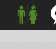
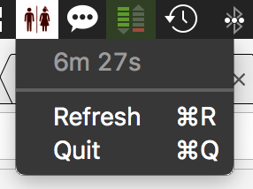

# WcStatus
Our toilet-occupied tracking app

Never turn up infront of a closed toilet anymore. This small Mac OS App indicates if the toilet is occupied or not.





## Getting Started

These instructions will get you a copy of the project up and running on your local machine for development and testing purposes. See deployment for notes on how to deploy the project on a live system.

### Prerequisites

In order to show the status, a service providing the information is necessary. 
We set up an arduino with a http service. 
Connected to the arduino is a simple switch which is mounted in the keyhole of the toilet door.
A blog post which shows the setup will follow soon.

The service provides following json data: 
```json
{
    "occupied": 0, 
    "time": 0
}
```

### Installing

The app is not yet in the app store. If you're interested to get a pre-release please get in touch with us info-at-4eyes.ch

## System Requirements

Mac OS X 10.9 Maverics or newer

## Contributing

Please feel free to submit pull requests

## Authors

* **Michel Georgy** - *Initial work* - [MichelGeorgy](https://github.com/MichelGeorgy)

## License

This project is licensed under the MIT License - see the [LICENSE.md](LICENSE.md) file for details
